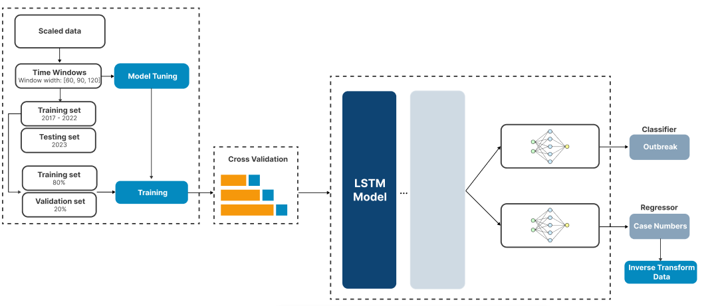

# MultiLSTM-ARB: Multitask LSTM for Arboviral Outbreak Prediction Using Public Health Data

<p align="center">

<br><br>
<b>Figure 1.</b> Workflow of the proposed multitask LSTM-based prediction framework.
</p>

## Installation & Setup

Clone the repository and install the required packages:


```bash
git clone https://github.com/Talitapach/MultiLSTM-ARB.git

cd MultiLSTM-ARB

pip install -r requirements.txt
```


## Repository Structure

- `src/`  
  Contains the main Python scripts:  
  - `Models.py` — LSTM architectures  
  - `ModelTuner.py` — Hyperparameter tuning with Keras Tuner  
  - `Outbreak_Classification.py` — Outbreak definition 
  - `Plotter.py` — Visualization utilities  
  - `Preprocessing.py` — Data cleaning and feature engineering  
  - `Training.py` — Model training   

- `notebooks/recife/dengue`  
  Jupyter notebooks for experiments and demonstrations:  
  - `deng_recife.ipynb` — Full workflow from data to results  

- `data/`   
  - `dengue_recife.parquet` — Cleaned dataset  

- `Dockerfile`  
  Defines the Docker environment for reproducible runs  

- `requirements.txt`  
  Required dependencies    


## FAQs
**Q**: How can I change the input window size?

**A**: Window size (60, 90, or 120 days) is configurable in the notebook via the WINDOW_SIZE parameter.

